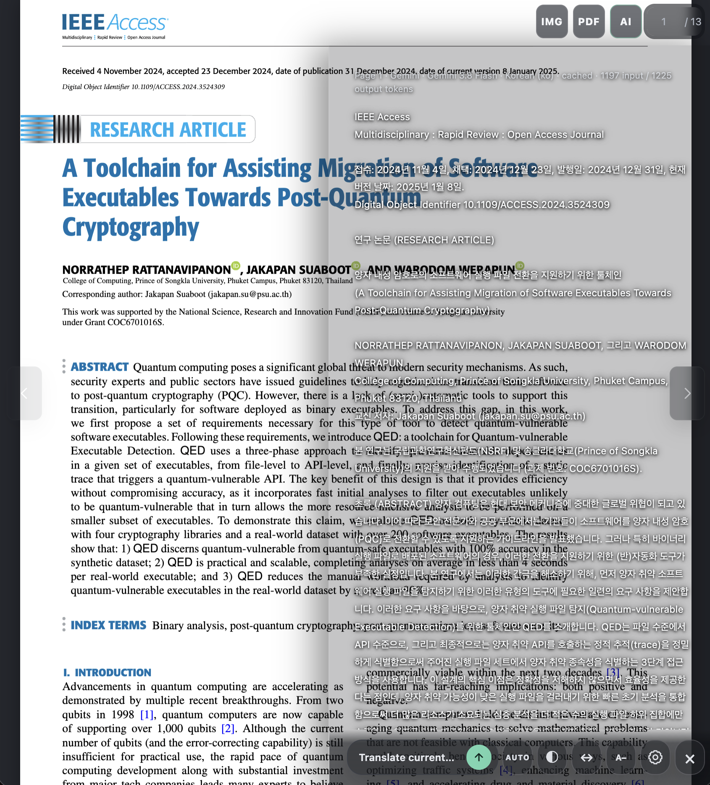
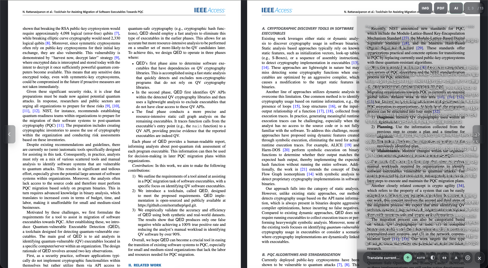
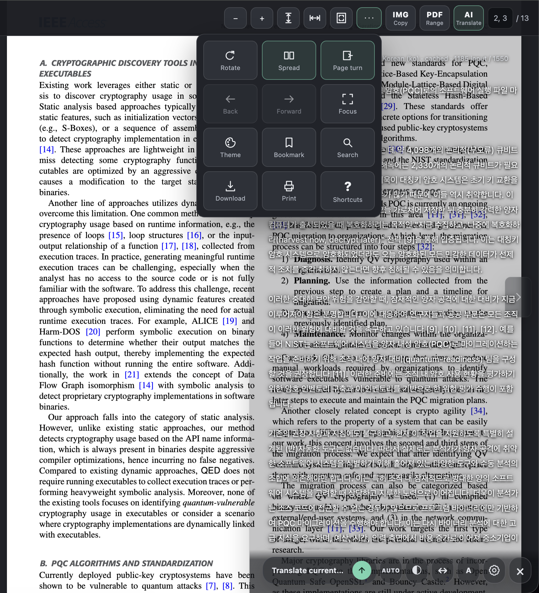
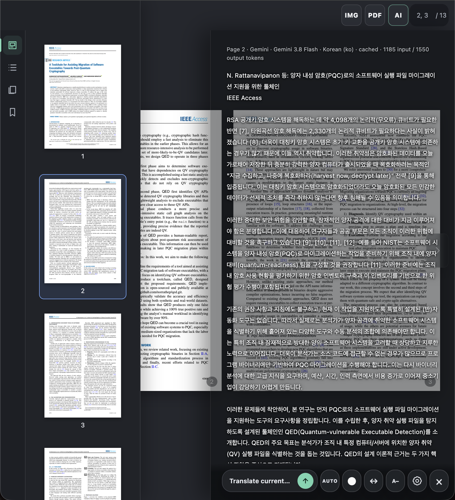

<p align="center">
  
</p>

<h1 align="center">PanePDF</h1>

<p align="center">
  A focused, local-first PDF reader for Chrome.<br>
  Read comfortably, capture clean pages, extract ranges, and translate without leaving the document.
</p>

<p align="center">
  <strong>Local PDF processing</strong> · <strong>Gemini & OpenAI translation</strong> · <strong>No analytics</strong>
</p>

> **Project status:** Active development. PanePDF is currently installed as an unpacked Chrome extension.

## Why PanePDF

PanePDF turns long PDFs into a quieter reading workspace. It replaces the browser's basic PDF view with a purpose-built reader while keeping document processing on your device. Optional AI translation appears directly over the original page, so you can compare both without repeatedly taking screenshots or switching apps.

## Preview

<p align="center">
  
</p>

<p align="center"><sub>Translate in context while keeping the original page visible underneath.</sub></p>

<details>
  <summary><strong>See two-page reading and document controls</strong></summary>
  <br>
  
  <br><br>
  <table>
    <tr>
      <td width="50%"></td>
      <td width="50%"></td>
    </tr>
    <tr>
      <td align="center"><sub>Focused controls without a crowded toolbar</sub></td>
      <td align="center"><sub>Thumbnails, outline, saved documents, and bookmarks</sub></td>
    </tr>
  </table>
</details>

## Highlights

### Read comfortably

- Continuous scrolling or page-turn reading
- Single-page and cover-first two-page spread layouts
- Fit width, fit height, and local content-aware fitting
- Original, Sepia, and Dark reading themes
- Focus/fullscreen mode and a compact auto-hiding toolbar
- Search, selectable text, links, outlines, thumbnails, and page history

### Keep your place

- Local document shelf with cover previews and drag reordering
- Per-document page, zoom, fit, rotation, and layout restoration
- Page bookmarks with editable titles and notes

### Capture and extract

- Copy the current page as a clean, margin-cropped PNG
- Extract an inclusive range such as `2-11` using original PDF page objects
- Download or print the unchanged source PDF

### Translate inside the reader

- Switch between Gemini and OpenAI with provider-specific models
- Translate one page or both pages in a visible spread
- Choose a target language by name or BCP 47 code
- Compare the translucent translation with the original page underneath
- Adjust panel opacity, width, and result font size
- Optionally translate uncached pages as you navigate with **AUTO**
- Keep one latest cached translation per document page
- Export cached results as a page-ordered UTF-8 text file

## Install locally

### Requirements

- Google Chrome 120 or newer
- Node.js 24 or newer
- npm

### Build and load

```bash
npm install
npm run build
```

1. Open `chrome://extensions`.
2. Enable **Developer mode**.
3. Select **Load unpacked**.
4. Choose the generated `dist/` directory.
5. Pin **PanePDF** to the toolbar.

After rebuilding, select **Reload** on the extension card. The generated `dist/` directory should not be edited directly.

## Quick start

1. Open the extension and select **Open empty reader**.
2. Choose **Open PDF**, drop a local file into the reader, or open a public PDF URL.
3. Use **IMG** to copy the current page, **PDF** to extract a range, or **AI** to open translation.
4. Open the left edge of the reader for thumbnails, outline, saved documents, and bookmarks.
5. Open **More** for rotation, layout, reading flow, themes, search, focus mode, download, print, and shortcut help.

Local file selection and drag-and-drop are the most reliable ways to open a document. Public URLs can fail when a server requires authentication, blocks cross-origin requests, or uses an expiring link.

## AI translation

1. Open **AI** or press <kbd>T</kbd>.
2. Open translation settings, select Gemini or OpenAI, choose a model, and enter your own API key.
3. Set the target language, then select the translate action or press <kbd>Shift</kbd> + <kbd>T</kbd>.
4. In spread mode, both visible pages are translated independently and displayed in page order with a divider.

Provider keys are held only in the current viewer tab's memory and are forgotten when that tab closes. They are never written to local storage or IndexedDB. Translation errors stay in the result panel with retry and settings actions.

**AUTO is opt-in.** When enabled, settling on an uncached page can create a billed provider request. Cached pages are shown locally without another request.

> **Distribution security:** Never bundle a project-owned API key in an extension. The current flow is bring-your-own-key (BYOK). If a distributed version will use a shared credential, put provider calls behind a server-side proxy or use short-lived credentials.

## Keyboard shortcuts

| Shortcut                                                 | Action                                                |
| -------------------------------------------------------- | ----------------------------------------------------- |
| <kbd>T</kbd>                                             | Open or close AI translation                          |
| <kbd>Shift</kbd> + <kbd>T</kbd>                          | Translate the current page or spread                  |
| <kbd>F</kbd>                                             | Enter or exit focus mode                              |
| <kbd>⌘/Ctrl</kbd> + <kbd>F</kbd>                         | Search the document                                   |
| <kbd>⌘/Ctrl</kbd> + <kbd>C</kbd>                         | Copy the current page as PNG when no text is selected |
| <kbd>⌘/Ctrl</kbd> + <kbd>Shift</kbd> + <kbd>C</kbd>      | Copy the current page through the extension command   |
| <kbd>⌘/Ctrl</kbd> + <kbd>S</kbd>                         | Download the original PDF                             |
| <kbd>⌘/Ctrl</kbd> + <kbd>P</kbd>                         | Print the original PDF                                |
| <kbd>Space</kbd> / <kbd>Page Down</kbd>                  | Move forward                                          |
| <kbd>Shift</kbd> + <kbd>Space</kbd> / <kbd>Page Up</kbd> | Move backward                                         |
| <kbd>Home</kbd> / <kbd>End</kbd>                         | First / last page                                     |
| <kbd>Alt</kbd> + <kbd>←/→</kbd>                          | Previous / next page-jump location                    |
| <kbd>←/→</kbd>                                           | Previous / next page in page-turn mode                |

Shortcuts do not take over while you are typing, interacting with controls, or selecting PDF text. The extension-wide copy shortcut can be changed at `chrome://extensions/shortcuts`.

## Privacy

| Data                               | Handling                                                    |
| ---------------------------------- | ----------------------------------------------------------- |
| Original PDF bytes                 | Processed in the browser and never sent to an AI provider   |
| AI input                           | Prepared image of only the requested visible page or spread |
| AI API keys                        | Kept only in current viewer-tab memory                      |
| Saved documents and reading state  | Stored locally in extension IndexedDB                       |
| Translation cache and token counts | Stored locally in a separate IndexedDB cache                |
| Analytics and telemetry            | None                                                        |

AI input is sent only after an explicit translation request or while the user-enabled **AUTO** mode is active.

## Permissions

- `activeTab` and `tabs`: inspect the user-invoked tab, open viewer tabs, and route commands
- `downloads`: save extracted PDFs and clipboard fallback PNGs
- `commands`: support the configurable copy-page shortcut
- `clipboardWrite`: write a rendered page PNG to the clipboard
- `http://*/*`, `https://*/*`, and `file:///*`: open user-selected PDF URLs and contact the selected AI provider when requested

There are no always-on content scripts and no passive browsing collection. Direct `file://` URLs require **Allow access to file URLs** in the extension's Chrome details; the file picker and drag-and-drop do not.

## Development

```bash
npm run dev          # rebuild on changes; reload the extension manually
npm run typecheck
npm run lint
npm run test
npm run build
npm run check        # run the full verification suite
npm run format
```

The project uses Manifest V3, strict TypeScript, Vite, vanilla DOM UI, PDF.js, and `@cantoo/pdf-lib`. See [AGENT.md](AGENT.md) for architecture and security decisions, and [docs/TESTING.md](docs/TESTING.md) for browser verification.

## Current limitations

- Chrome's built-in PDF viewer is not modified; PDFs open in the extension reader.
- Authenticated, expiring, referrer-restricted, or CORS-blocked PDF URLs may need to be downloaded first.
- Scanned PDFs need an existing OCR text layer for text selection and search.
- Forms, annotation editing, attachments, embedded PDF JavaScript, and encrypted PDFs are not supported.
- Extremely large documents remain subject to browser memory and local-storage quotas.
- AI translation requires an eligible provider key, available quota or billing, and an internet connection.

## Troubleshooting

### The extension does not appear

Run `npm run build`, load `dist/` rather than the source directory, and reload the extension after every new build.

### A PDF URL does not open

Download the PDF and open it locally. PanePDF does not bypass authentication, origin restrictions, or temporary-link expiry.

### Translation fails

Confirm that the selected provider matches the entered key and that the provider project has API access and available quota. The complete provider error remains in the translation panel. Closing the viewer clears the key, so it must be entered again in a new tab.

### A shortcut conflicts with another extension

Open `chrome://extensions/shortcuts`, assign a different extension shortcut, and keep the PanePDF viewer active when using it.
